# Noir

Noir is a Lua scratchpad that lives inside Garry's Mod. It's for quick in-game tinkering — poke at an entity, try out a snippet, check what some function returns, mess with the world — without leaving the game or setting up a whole file. There's a proper editor behind it (it's [gmod-monaco](https://github.com/Metastruct/gmod-monaco), i.e. actual Monaco, the thing VS Code is built on), a REPL, and a way to fire code off wherever you need it.

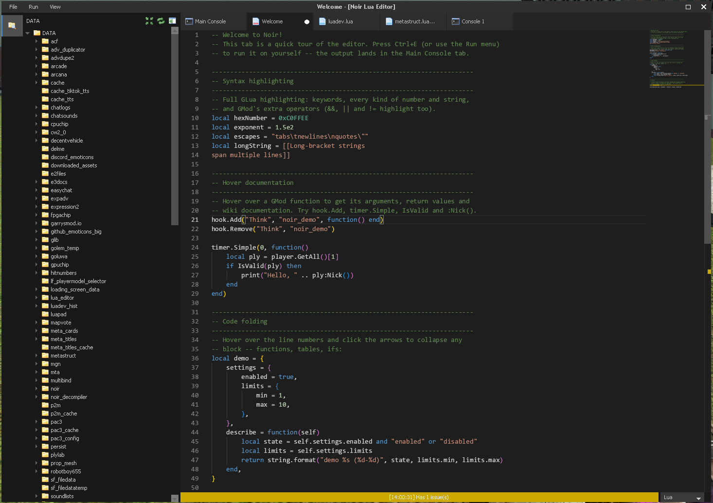

It needs the GMod **chromium** branch, since Monaco lives in an embedded browser panel.

## Running code

Write some Lua and run it on whatever you want — yourself, the server, every client, one specific client, or shared. Whatever it prints or returns comes back to your console, and it keeps coming: if your snippet sets up a hook or a timer, that output keeps streaming in long after the code itself finished.

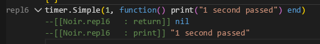

## The console

The REPL is the same Monaco editor under the hood, so it's not some sad single-line text box — you get syntax highlighting, autocomplete, the works. Results fold up, so dumping a huge table doesn't wreck your scrollback; it collapses to one line you can pop open when you care.

There are some easylua-style shortcuts baked in — `me`, `this`, `there`, `dir`, and search tables like `all`, `us`, `bots`, `props`. Typing a player's name just finds them. `last` is whatever the previous line returned, so you can keep building on it. And when a result has functions in it, each one gets a clickable link to wherever it's actually defined.

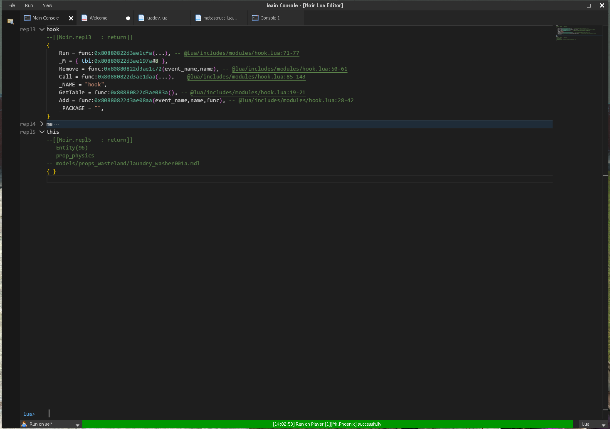

## The decompiler

This is the bit I'm most proud of. `jit_decompiler2` takes LuaJIT 2.1 bytecode and turns it back into readable Lua. So if a run hands you back a function you don't have the source for — a built-in, something from another addon, some closure that got passed around — Noir just shows you the code. It figures out constants, upvalues, and (when the debug info survived) the real local names. Numbers stay numbers, strings stay strings, color constants even get a little swatch. Beats staring at `function: 0x7f…`.

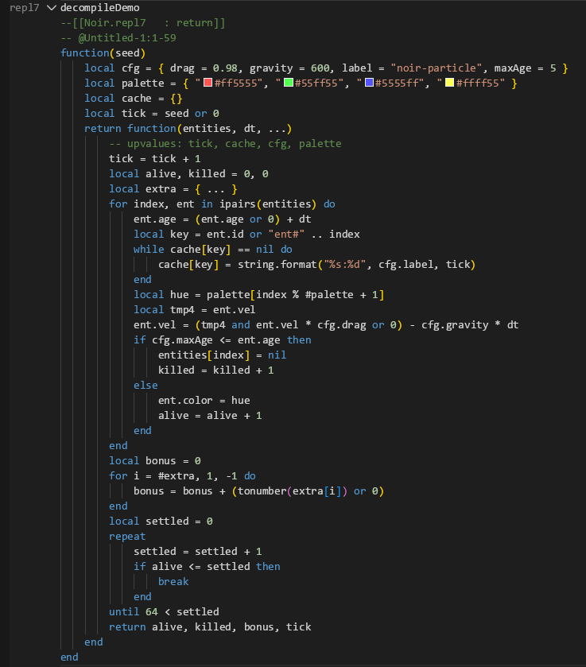

^ this was actualy decompiled from a runtime function
## Poking at the world

When you want to grab a specific entity to mess with, there's an in-world picker — point at something, pick it from a nearby list, or filter by class/model — and it hands the entity straight back to your code.

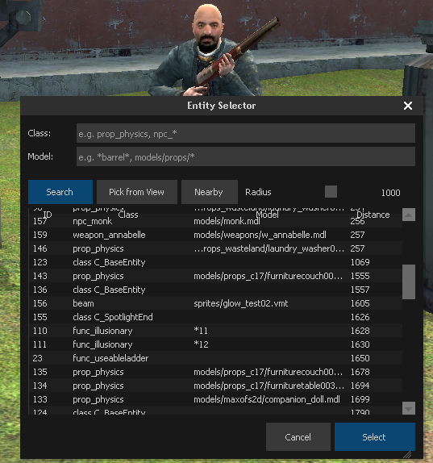

## Find in Files

Grep every Lua file at once — both locally and on the remote server — without freezing the game. It runs on a little time budget per frame and does a quick pass to count files first, so the progress bar is actually accurate instead of guessing. `Ctrl+Shift+F`.

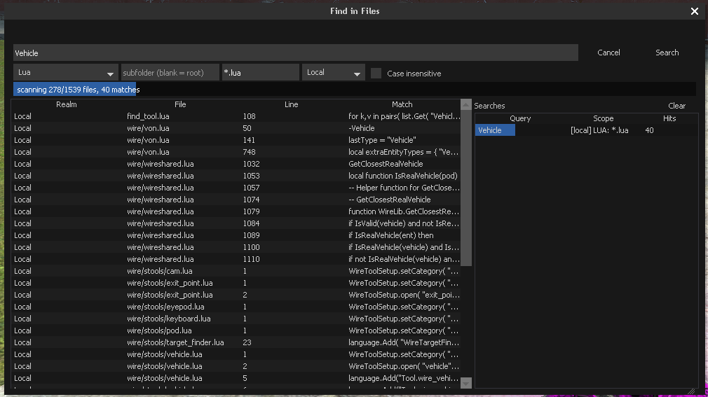

## Autorun

You can keep a list of scripts that run every time Noir loads. It's paranoid about crashes: it flags that a script is running *before* it runs, and clears the flag after — so if one of them hard-crashes the game, that flag is still set on the next load and autorun just switches itself off instead of crash-looping you forever. It's all configured from Noir's dashboard, which any module can hang its own settings tab off of.

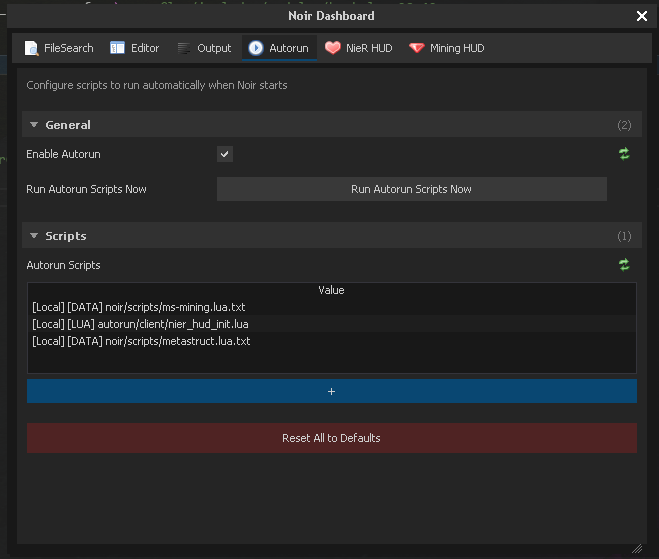

There's also a file browser for opening and saving across `DATA`, `LUA`, and `GAME` paths, for when a snippet grows up into something you want to keep.

## Editor stuff you get from Monaco

Since it's built on Monaco, the editing is nicer than you'd expect from something running inside a game.

Autocomplete knows the whole GMod API — functions, methods, enums, hooks, with signatures — and hovering something pulls up its wiki docs right there.

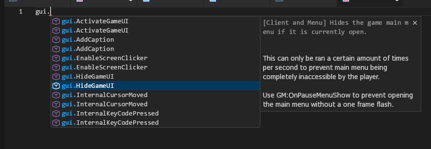

It's not just the static API either. Noir walks your *actual* runtime tables, so your own globals and objects show up in autocomplete too.

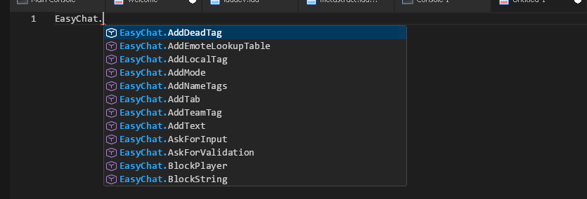

luacheck runs as you type, so mistakes get underlined and listed at the bottom before you even hit run.

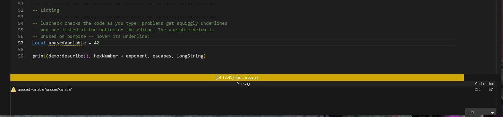

And there's the usual Monaco kit — command palette (`Ctrl+Shift+P`, with Noir's run commands wired in), code folding, tabs with a VS Code-style activity bar and file tree, clickable `@file.lua:line` references, snippets, a minimap, a custom theme.

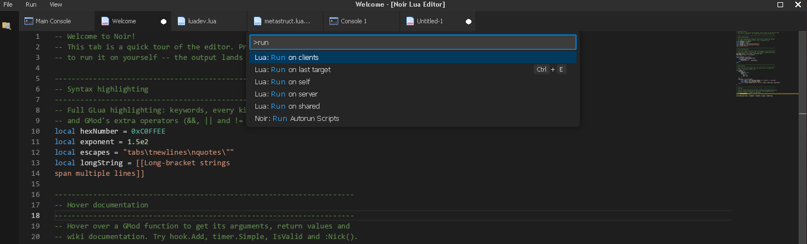

## NDL

There's also a little debug library on the `NDL` global you can use from the REPL — detours, argument filters, call tracers (`NDL.MakeDetour`, `NDL.MakeArgsFilter`, `NDL.MakeCallTracer`). Handy when you're trying to work out what's calling what.
